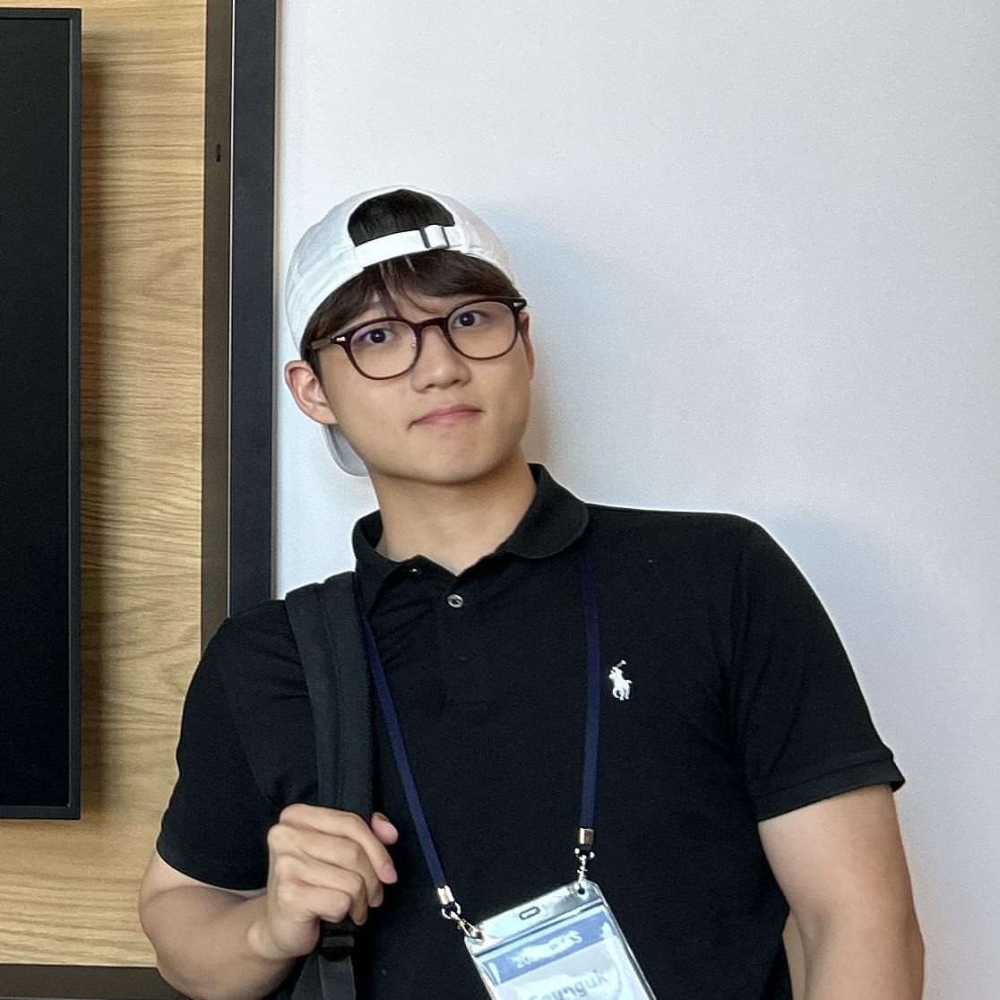
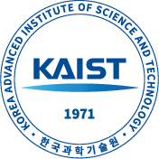
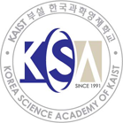

```{=html}
<div class="sk-about-page">
  <div class="sk-mobile-notice">
    This page is optimized for desktop viewing. Please use a larger screen for the best layout.
  </div>

  <div class="sk-about-hero">
    
    <div>
      <h1 class="sk-profile-name">Seunguk Kang</h1>
      <p class="sk-profile-role">Researcher · AI &amp; Computational Chemistry</p>
      <p class="sk-about-intro">
        Hi! I’m an undergraduate student in chemistry at KAIST, currently conducting research in Prof. Woo Youn Kim’s group.
      </p>
      <p class="sk-about-intro">
        Previously, I worked in Prof. Mu-Hyun Baik’s group on computational studies of organometallic catalysts and photochemical systems, using DFT calculations, QM/MM, and molecular dynamics.
      </p>
      <p class="sk-about-intro">
        Currently, I’m developing a neural free energy estimator for molecular ensembles, where learned nonequilibrium generative paths are combined with Jarzynski-equality-based sampling to estimate free energy differences.
      </p>
      <p class="sk-about-intro">
        In the long term, I hope to study biological challenges from a mechanistic, physics-grounded perspective. I’m especially interested in the molecular mechanisms underlying Alzheimer’s disease, including the dynamics of intrinsically disordered proteins.
      </p>
      <div class="sk-social-links">
        <a href="https://github.com/seungukkang" target="_blank" rel="noopener" aria-label="GitHub profile">
          <i class="bi bi-github" aria-hidden="true"></i>
          GitHub
        </a>
        <a href="https://www.linkedin.com/in/seungukkang319/" target="_blank" rel="noopener" aria-label="LinkedIn profile">
          <i class="bi bi-linkedin" aria-hidden="true"></i>
          LinkedIn
        </a>
        <a href="mailto:drkd319@kaist.ac.kr" aria-label="Email Seunguk Kang">
          <i class="bi bi-envelope" aria-hidden="true"></i>
          Email
        </a>
        <a href="assets/cv/Seunguk_CV.pdf" target="_blank" rel="noopener" aria-label="Download CV">
          <i class="bi bi-file-earmark-text" aria-hidden="true"></i>
          CV
        </a>
      </div>
    </div>
  </div>

  <section class="sk-about-section" id="education">
    <h2>Education</h2>
    <div class="sk-entry-list">
      <article class="sk-entry">
        <div class="sk-entry-mark">
          
        </div>
        <div class="sk-entry-body">
          <div class="sk-entry-header">
            <div>
              <h3>Korea Advanced Institute of Science and Technology (KAIST)</h3>
              <p class="sk-entry-role"><em>Bachelor of Science - Chemistry</em></p>
            </div>
            <div class="sk-entry-meta">
              <span>Daejeon, Republic of Korea</span>
              <span>2022 - Present</span>
            </div>
          </div>
        </div>
      </article>

      <article class="sk-entry">
        <div class="sk-entry-mark">
          
        </div>
        <div class="sk-entry-body">
          <div class="sk-entry-header">
            <div>
              <h3>Korea Science Academy (KSA)</h3>
              <p class="sk-entry-role"><em>High School Diploma - Chemistry</em></p>
            </div>
            <div class="sk-entry-meta">
              <span>Busan, Republic of Korea</span>
              <span>2019 - 2021</span>
            </div>
          </div>
        </div>
      </article>
    </div>
  </section>

  <section class="sk-about-section" id="research-experiences">
    <h2>Research Experiences</h2>
    <div class="sk-entry-list">
      <article class="sk-entry sk-entry-plain">
        <div class="sk-entry-body">
          <div class="sk-entry-header">
            <div>
              <h3><a class="sk-lab-link" href="https://wooyoun.kaist.ac.kr/" target="_blank" rel="noopener noreferrer">Intelligent Chemistry Lab<span class="sk-link-icon" aria-hidden="true"></span><span class="visually-hidden"> website</span></a> <span class="sk-entry-separator">&middot;</span> KAIST</h3>
              <p class="sk-entry-role">Undergraduate Researcher</p>
              <p class="sk-entry-advisor">Advisor: Prof. Woo Youn Kim</p>
            </div>
            <div class="sk-entry-meta">
              <span>Dec. 2025 - Present</span>
            </div>
          </div>
          <ul class="sk-entry-bullets">
            <li>Developing a neural free energy estimator (NFEE) for estimating free energy differences of small-molecule ensembles using learned nonequilibrium generative paths.</li>
            <li>Building AD-Agent, a mechanism-aware multi-agent framework for drug repurposing in Alzheimer’s disease.</li>
            <li>Studied induced-fit antibody–antigen interaction modeling with a Riemannian Diffusion Bridge-based E(3)-equivariant generative framework.</li>
          </ul>
        </div>
      </article>

      <article class="sk-entry sk-entry-plain">
        <div class="sk-entry-body">
          <div class="sk-entry-header">
            <div>
              <h3><a class="sk-lab-link" href="https://baik-laboratory.com/" target="_blank" rel="noopener noreferrer">Baik Group<span class="sk-link-icon" aria-hidden="true"></span><span class="visually-hidden"> website</span></a> <span class="sk-entry-separator">&middot;</span> KAIST</h3>
              <p class="sk-entry-role">Undergraduate Researcher</p>
              <p class="sk-entry-advisor">Advisor: Prof. Mu-Hyun Baik</p>
            </div>
            <div class="sk-entry-meta">
              <span>Jan. 2024 - Dec. 2025</span>
            </div>
          </div>
          <ul class="sk-entry-bullets">
            <li>Studied the mechanism of enantioselective amino-tetralin synthesis catalyzed by an indenyl-Rh complex.</li>
            <li>Performed DFT benchmarking studies on substituent-dependent reactivity in relation to Hammett substituent constants.</li>
            <li>Investigated the mechanism of a solid-state stereoselective [2+2] photocycloaddition.</li>
          </ul>
        </div>
      </article>

      <article class="sk-entry sk-entry-plain">
        <div class="sk-entry-body">
          <div class="sk-entry-header">
            <div>
              <h3><a class="sk-lab-link" href="https://yoon.kaist.ac.kr/" target="_blank" rel="noopener noreferrer">Soft Material Assembly Group<span class="sk-link-icon" aria-hidden="true"></span><span class="visually-hidden"> website</span></a> <span class="sk-entry-separator">&middot;</span> KAIST</h3>
              <p class="sk-entry-role">Undergraduate Researcher</p>
              <p class="sk-entry-advisor">Advisor: Prof. Dong Ki Yoon</p>
            </div>
            <div class="sk-entry-meta">
              <span>Jun. 2023 - Dec. 2023</span>
            </div>
          </div>
          <ul class="sk-entry-bullets">
            <li>Studied tunable electrical conductivity anisotropy in a MOF-polymer composite using Cu<sub>3</sub>(HHTP)<sub>2</sub>.</li>
            <li>Investigated the applications of MOF-polymer composites as selective gas sensors.</li>
          </ul>
        </div>
      </article>

      <article class="sk-entry sk-entry-plain">
        <div class="sk-entry-body">
          <div class="sk-entry-header">
            <div>
              <h3>Choi Group <span class="sk-entry-separator">&middot;</span> KSA</h3>
              <p class="sk-entry-role">Student Researcher</p>
              <p class="sk-entry-advisor">Advisor: Prof. Eun Young Choi</p>
            </div>
            <div class="sk-entry-meta">
              <span>Apr. 2019 - Dec. 2021</span>
            </div>
          </div>
          <ul class="sk-entry-bullets">
            <li>Performed gas and ion exchange experiments on zeolite single crystals under high-vacuum conditions.</li>
            <li>Developed protocols to successfully activate fragile porphyrin-based metal-organic frameworks to improve their gas adsorption capacity.</li>
          </ul>
          <p class="sk-entry-subheading">Singapore International Collaborative Research Program</p>
          <ul class="sk-entry-bullets">
            <li>Synthesized Zn-, Co-, and Ag-tartrate metal-organic frameworks and investigated their antibacterial properties.</li>
            <li>Studied biocompatible metal-tartrate frameworks synthesized by the room-temperature rapid self-assembly method.</li>
          </ul>
        </div>
      </article>
    </div>
  </section>

  <section class="sk-about-section" id="publications">
    <h2>Publications</h2>
    <div class="sk-publication-list">
      <article class="sk-publication">
        <span class="sk-publication-number">[1]</span>
        <div>
          <p class="sk-publication-title">Enantioselective Olefin 1,2-Arylamination Catalyzed by a Planar Chiral Indenyl-Rhodium(III) Complex.</p>
          <p class="sk-publication-authors">Gross, P.; Choi, H.; Pullara, W. A.; Im, H.; Ung, K.; <strong>Kang, S.</strong>; Baik, M.-H.; Blakey, S. B.</p>
          <p class="sk-publication-venue"><span class="sk-venue-badge">ACS Catal.</span> <strong>2026</strong>, 16(4), 3453-3463.</p>
          <div class="sk-publication-links">
            <a href="https://doi.org/10.1021/acscatal.5c07589" target="_blank" rel="noopener noreferrer">Link</a>
            <a href="https://pubs.acs.org/doi/pdf/10.1021/acscatal.5c07589" target="_blank" rel="noopener noreferrer">PDF</a>
          </div>
        </div>
      </article>

      <article class="sk-publication">
        <span class="sk-publication-number">[2]</span>
        <div>
          <p class="sk-publication-title">On-Demand Tunable Electrical Conductance Anisotropy in a MOF-Polymer Composite.</p>
          <p class="sk-publication-authors">Hong, T.; Lee, C.; Bak, Y.; Park, G.; Lee, H.; <strong>Kang, S.</strong>; Bae, T.-H.; Yoon, D. K.; Park, J. G.</p>
          <p class="sk-publication-venue"><span class="sk-venue-badge">Small</span> <strong>2024</strong>, 20(18), 2309469.</p>
          <div class="sk-publication-links">
            <a href="https://doi.org/10.1002/smll.202309469" target="_blank" rel="noopener noreferrer">Link</a>
            <a href="https://onlinelibrary.wiley.com/doi/pdf/10.1002/smll.202309469" target="_blank" rel="noopener noreferrer">PDF</a>
          </div>
        </div>
      </article>
    </div>
  </section>

  <section class="sk-about-section" id="selected-presentations">
    <h2>Selected Presentations</h2>
    <div class="sk-activity-list">
      <article class="sk-activity">
        <div>
          <h3>Spring Conference of the Korean Chemical Society <span class="sk-type-badge">Poster</span></h3>
          <p>Chiral Indenyl Rh-Catalyzed Enantioselective Olefin 1,2-Arylamination</p>
        </div>
        <div class="sk-activity-meta">
          <span>2025</span>
        </div>
      </article>

      <article class="sk-activity">
        <div>
          <h3>Research Presentation for Chemistry Department Workshop <span class="sk-type-badge">Oral</span></h3>
          <p>Chiral Indenyl Rh-Catalyzed Enantioselective Olefin 1,2-Arylamination</p>
        </div>
        <div class="sk-activity-meta">
          <span>2024</span>
        </div>
      </article>

      <article class="sk-activity">
        <div>
          <h3>Future Chemists Research Conference of the Korean Chemical Society <span class="sk-type-badge">Poster</span></h3>
          <p>Biocompatible MOFs Developed by Facile Ultra-Fast Room Temperature Synthesis</p>
        </div>
        <div class="sk-activity-meta">
          <span>2021</span>
        </div>
      </article>

      <article class="sk-activity">
        <div>
          <h3>Thailand International Science Fair <span class="sk-type-badge">Oral</span></h3>
          <p>Improvement of Gas Adsorption Efficiency of Fragile Porphyrin-based MOFs</p>
        </div>
        <div class="sk-activity-meta">
          <span>2021</span>
        </div>
      </article>

      <article class="sk-activity">
        <div>
          <h3>Autumn Conference of the Korean Polymer Society <span class="sk-type-badge">Poster</span></h3>
          <p>Improvement of Gas Adsorption Efficiency of Fragile Porphyrin-based MOFs</p>
        </div>
        <div class="sk-activity-meta">
          <span>2020</span>
        </div>
      </article>

      <article class="sk-activity">
        <div>
          <h3>Japan Super Science Fair <span class="sk-type-badge">Oral</span></h3>
          <p>Optimizing Synthesis Conditions of PPF-4: Effect of Acid Addition on Crystal Growth</p>
        </div>
        <div class="sk-activity-meta">
          <span>2020</span>
        </div>
      </article>
    </div>
  </section>

  <section class="sk-about-section" id="honors-and-awards">
    <h2>Honors and Awards</h2>
    <div class="sk-activity-list">
      <article class="sk-activity">
        <div>
          <h3>Best Participant Award</h3>
          <p>Global Entrepreneurship Summer School.</p>
        </div>
        <div class="sk-activity-meta">
          <span>2024</span>
        </div>
      </article>

      <article class="sk-activity">
        <div>
          <h3>2nd Prize</h3>
          <p>IR Pitching Contest, Global Entrepreneurship Summer School.</p>
        </div>
        <div class="sk-activity-meta">
          <span>2024</span>
        </div>
      </article>

      <article class="sk-activity">
        <div>
          <h3>Talent Award of Korea <span class="sk-award-badge">National Prize</span></h3>
          <p>Ministry of Education, Republic of Korea.</p>
          <p>Awarded by the Deputy Prime Minister and Minister of Education to 100 individuals nationwide who exemplify future leadership.</p>
        </div>
        <div class="sk-activity-meta">
          <span>2021</span>
        </div>
      </article>

      <article class="sk-activity">
        <div>
          <h3>Meritorious Service Award</h3>
          <p>Graduation of Korea Science Academy.</p>
        </div>
        <div class="sk-activity-meta">
          <span>2021</span>
        </div>
      </article>

      <article class="sk-activity">
        <div>
          <h3>Academic Excellence Award and Comprehensive Studies Award</h3>
          <p>Chemistry Department, Korea Science Academy. 1st and 2nd semesters.</p>
        </div>
        <div class="sk-activity-meta">
          <span>2020, 2021</span>
        </div>
      </article>

      <article class="sk-activity">
        <div>
          <h3>Gold Prize</h3>
          <p>World Invention Creativity Olympic (WICO), International Competition.</p>
        </div>
        <div class="sk-activity-meta">
          <span>2017</span>
        </div>
      </article>

      <article class="sk-activity">
        <div>
          <h3>The Minister's Award <span class="sk-award-badge">National Prize</span></h3>
          <p>Korean Youth Invention Idea Contest, Ministry of Science and ICT, Republic of Korea.</p>
        </div>
        <div class="sk-activity-meta">
          <span>2017</span>
        </div>
      </article>

      <article class="sk-activity">
        <div>
          <h3>Silver Prize</h3>
          <p>Youth Science Debate Competition, National Competition.</p>
        </div>
        <div class="sk-activity-meta">
          <span>2015</span>
        </div>
      </article>
    </div>
  </section>

  <section class="sk-about-section" id="extra-activities">
    <h2>Extra Activities</h2>
    <div class="sk-activity-list">
      <article class="sk-activity">
        <div>
          <h3>Team Leader (CEO)</h3>
          <p>Mock start-up, KAIST ENablers.</p>
        </div>
        <div class="sk-activity-meta">
          <span>2024</span>
        </div>
      </article>

      <article class="sk-activity">
        <div>
          <h3>Band Leader</h3>
          <p>KAIST undergraduate band, CarpeDiem.</p>
        </div>
        <div class="sk-activity-meta">
          <span>2022 - 2023</span>
        </div>
      </article>

      <article class="sk-activity">
        <div>
          <h3>Research Lead</h3>
          <p>Singapore International Cooperative Research Team.</p>
        </div>
        <div class="sk-activity-meta">
          <span>2021</span>
        </div>
      </article>

      <article class="sk-activity">
        <div>
          <h3>Band Leader</h3>
          <p>Korea Science Academy band, Loony.</p>
        </div>
        <div class="sk-activity-meta">
          <span>2019 - 2021</span>
        </div>
      </article>
    </div>
  </section>
</div>
```
